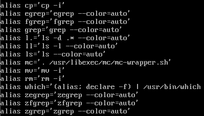
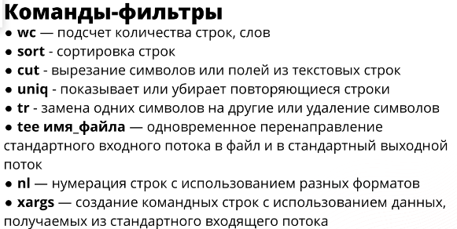

> mknode - создание cпециального файла устройств

> mkfifo - создание именованного канала

> file - информация о характере содержимого файла

> cut - используется для разделения строк файла и вывода только определенных столбцов

`cut -f2,4 -d' ' file.txt`

> tr - замена один симвлов на других. Можно потокам

Вот несколько примеров использования команды tr:

Заменить все символы "a" на "b" в строке "apple":

`echo "apple" | tr 'a' 'b'`

Вывод: bpple

Удалить все символы "e" из строки "example":

`echo "example" | tr -d 'e'`

Вывод: xampl

Перевести все символы в строке "HELLO WORLD" в нижний регистр:

`echo "HELLO WORLD" | tr 'A-Z' 'a-z'`

Вывод: hello world

Заменить все пробелы на символы табуляции в файле file.txt:

`tr ' ' '\t' < file.txt`

Удалить все цифры из строки "12345abcde":

echo "12345abcde" | tr -d '0-9'
Вывод: abcde

