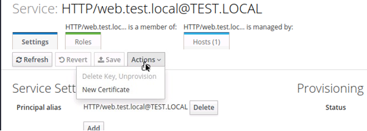
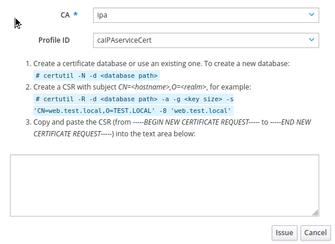

Сертификат от корпоративного CA FreeIPA



На самом скриншоте есть гайд по пунктам



На рабочем клиенте:

Если нет certutil:

`apt-get install nss-utils -y`

```bash
certutil -D -n /opt/pki
certutil -R -d /opt/pki -a -g 2048 -s 'CN=web.test.local,O=TEST.LOCAL' -8 'web.test.local' # -8 - subjectAltName Может быть много SAN`ов
```

Скопируйте тело CSR и подпишите его.

Далее подпись вертите обратно, скопируйте его и впишите в certutil

При создании сертификата учитывайте параметры SAN (subjectAltName), флаг `-8` их может быть очень много. А также AuthType
Экспорт из NSS Базы данных в RAW формат

Также обратите внимание, можно использовать другие флаги для keyUsage

`-6`, например `-6 serverAuth`

А также, обозначить, что это сертификат сервера

`-5`, например `-5 sslServer`

Обычная такое используется для интерфейсов серверов и маршрутизаторов

```bash
pk12util -d . -r -n web-test-local -o bundle.p12 # -n - alias
openssl pkcs12 -in bundle.p12 -out web.crt -clcerts -nokeys
openssl pkcs12 -in bundle.p12 -out web.key -nocerts -nodes
```

Ваши файлы: web.key - ключ и web.crt - сам сертификат

## ==============

Вы можете создать запрос на сертификат (CSR) с указанными параметрами через файл, используя утилиту certutil для Linux. Вот шаги для создания CSR:

1. Создайте файл с именем `cert_template.txt` и добавьте в него следующее содержимое, заменив `<IP_ADDRESS>` и `<DNS_NAME>` на ваши IP-адрес и DNS-имя соответственно:

```
certificate template
cn = <Common Name>
o = <Organization>
serialNumber = <Serial Number>
ou = <Organizational Unit>
emailAddress = <Email Address>
subjectAltName = ip:<IP_ADDRESS>, dns:<DNS_NAME>
extendedKeyUsage = serverAuth
keyUsage = digitalSignature, keyEncipherment
nsCertType = server
```

2. Создайте запрос на сертификат (CSR) с использованием утилиты certutil и файла шаблона, созданного на предыдущем шаге:

```
certutil -R -n "My Certificate" -t "CTu,CTu,CTu" -m 1000 -v 120 -d . -x -k rsa -g 2048 -a -z SHA256 -f cert_template.txt -o my_certificate.csr
```

Эта команда создаст запрос на сертификат (CSR) с указанными параметрами и сохранит его в файле `my_certificate.csr`.

Тело запроса можно скопировать и подписать

3. Проверьте созданный CSR:

```
certutil -L -d .
```

После создания CSR вы можете отправить его в доверенный центр сертификации (CA) для получения сертификата, подписанного этим центром сертификации.
