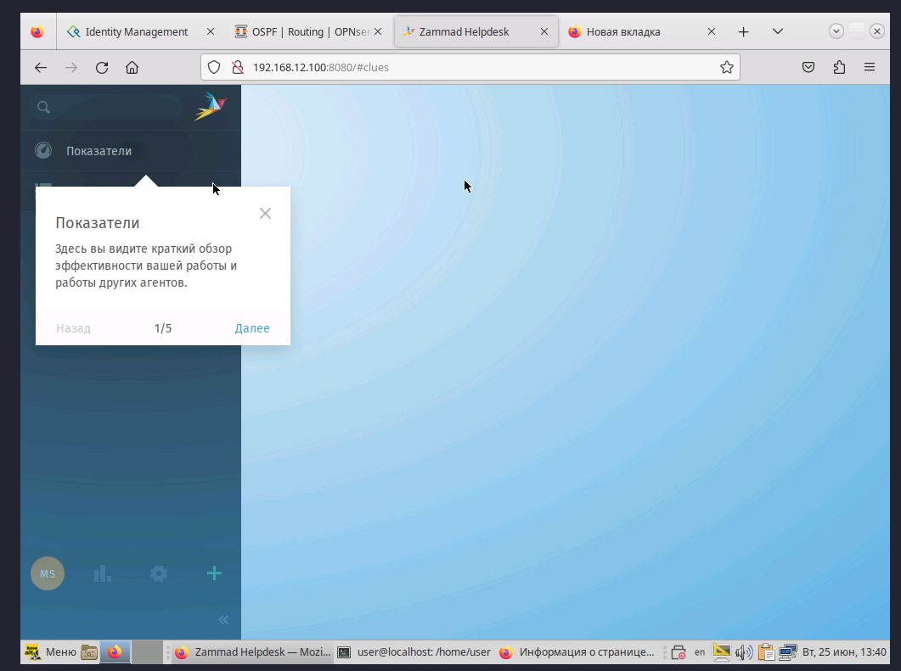

Как скачали [Docker](docker.md) можно переходить к тикет приколам

Качем гит:

`apt-get install git -y`

После качаем репу куда надо

`cd /opt/`
`git clone https://github.com/zammad/zammad-docker-compose.git`

Заходим внутрь

`cd zammad-docker-compose`

Меняем параметры внутри docker-compose.yml на те, что нужны по заданию

`nano docker-compose.yml`

По сути тут только требуется изменения для nginx контейнера, думаю, что будет правильно смонтировать дополнительно volume внутри файла и перекинуть туда сертификаты и conf файлы для nginx

Создаём новый контейнер в файле docker-compose.yml

```bash
# Дописываем ниже с учётом пробелом. ALT+P в помощь
services:
  web:
    image: nginx
    volumes:
      - /opt/web:/etc/nginx/conf.d
    ports:
      - 80:80
      - 443:443
    depends_on:
      - zammad-nginx
    restart: always
```

В общей директории /opt/web нужен конфиг, сертификат, ключ (default.conf, zam.crt, zam.key)

Конфигурационный файл:

```bash
server {
  listen *:80;
  server_name _;
  location / {
    return 301 https://zam.test.local;
  }
}
server {
  listen *:443 ssl;
  server_name zam.jun.profi;
  ssl_certificate conf.d/zam.crt;
  ssl_certificate_key conf.d/zam.key;
  location / {
    proxy_pass http://zammad-nginx:8080;
  }
}
```

И поднимаем

`docker-compose up -d`

И типо всё!!! Можно зайти на сервер по https через браузер.

В браузере укажите пользователя-админа и url ваш домен по которому нужна заходить на сайт

Учтите, что минимум 3 ГБ и 3 Ядра нужно


